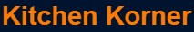

  <!-- You are encouraged to replace this logo with your own! Otherwise you can also remove it. -->
  
   

  <h3><b>Kitchen Korner README</b></h3>

<!-- TABLE OF CONTENTS -->

# 📗 Table of Contents

- [📖 About the Project](#about-project)
  - [🛠 Built With](#built-with)
    - [Tech Stack](#tech-stack)
    - [Key Features](#key-features)
  - [🚀 Live Demo](#live-demo)
- [💻 Getting Started](#getting-started)
  - [Setup](#setup)
  - [Prerequisites](#prerequisites)
  - [Install](#install)
  - [Usage](#usage)
  - [Run tests](#run-tests)
  - [Deployment](#deployment)
- [👥 Authors](#authors)
- [🔭 Future Features](#future-features)
- [🤝 Contributing](#contributing)
- [⭐️ Show your support](#support)
- [🙏 Acknowledgements](#acknowledgements)
- [📝 License](#license)

<!-- PROJECT DESCRIPTION -->

# 📖 Kitchen Korner 

> [Kitchen Korner]

**[Kitchen_Korner]** is website that communicate with TheMealDb API and involvement API to reserve Kitchen for the users. It has like button and comment section to interact with the user

## 🛠 Built With 

### Tech Stack 

> HTML
> CSS and
> Javascript

<!-- Features -->

### Key Features 

- **[Fetch meals from MealDb API]**
- **[Post Comment, like and reservations to Involvement API]**
- **[Render posted comment and reservation to the user]**
- **[Increment the like count]**

(<a href="#readme-top">back to top</a>)

<!-- LIVE DEMO -->

## 🚀 Live Demo 

- [Live Demo Link](https://yaredtekle022.github.io/javascript-capstone/dist/)

(<a href="#readme-top">back to top</a>)

 # Project Video Documentation
 Click <a href="https://drive.google.com/file/d/1B7nVFG4t_bwDwSVqmHtf0MkK1DsUz5rz/view?usp=sharing"> here </a> to watch video

<!-- GETTING STARTED -->

## 💻 Getting Started 

To get a local copy up and running, follow these steps.

### Prerequisites

In order to run this project you need node package manager 

 npm install 

### Setup

Clone this repository to your desired folder:

  cd my-folder 
  git clone https://github.com/yaredtekle022/javascript-capstone

### Install

Install this project with: 

  npm install

### Usage

To run the project, execute the following command: 

  npm start

### Deployment

You can deploy this project using github page deployment.

(<a href="#readme-top">back to top</a>)

<!-- AUTHORS -->

## 👥 Authors 

👤 **Yared Tekle**

- GitHub: [@yaredtekle022](https://github.com/yaredtekle022)
- Twitter: [@YaredTekle22](https://twitter.com/YaredTekle22)
- LinkedIn: [yared-tekle-5708ba22b](https://www.linkedin.com/in/yared-tekle-5708ba22b/)

👤 **Jawad Nazari**

- GitHub: [@Jawad-Nazari](https://github.com/Jawad-Nazari)
- LinkedIn: [Jawad-Nazari](https://www.linkedin.com/in/Jawad-)
- Twitter: [@nazari_jawad58](https://twitter.com/nazari_jawad58)

👤 **TOM DANIEL**

- GitHub: [@tomdan-ai](https://github.com/tomdan-ai)
- Twitter: [@kingWebstar](https://twitter.com/tomudoh1)
- LinkedIn: [LinkedIn](https://linkedin.com/in/https://www.linkedin.com/in/tom-udoh-a89046256/)

(<a href="#readme-top">back to top</a>)

<!-- FUTURE FEATURES -->

## 🔭 Future Features 

- [ ] **[Add Delivery of meals]**

(<a href="#readme-top">back to top</a>)

<!-- CONTRIBUTING -->

## 🤝 Contributing 

Contributions, issues, and feature requests are welcome!

Feel free to check the [issues page](../../issues/).

(<a href="#readme-top">back to top</a>)

<!-- SUPPORT -->

## ⭐️ Show your support 

If you like this project...

(<a href="#readme-top">back to top</a>)

<!-- ACKNOWLEDGEMENTS -->

## 🙏 Acknowledgments 

I would like to thank...

(<a href="#readme-top">back to top</a>)

<!-- LICENSE -->

## 📝 License 

This project is [MIT](./MIT.md) licensed.

_NOTE: we recommend using the [MIT license]

(<a href="#readme-top">back to top</a>)
